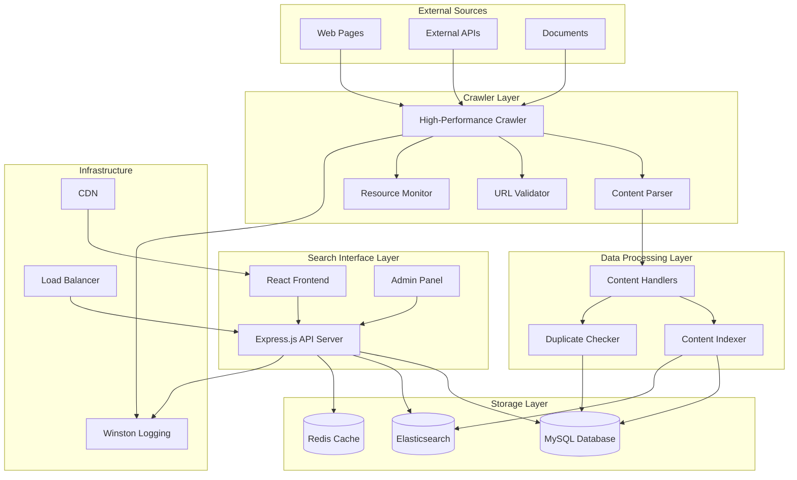
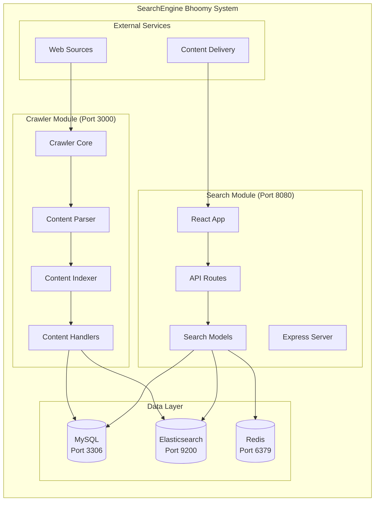
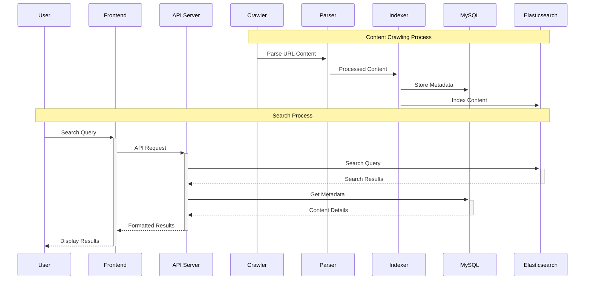
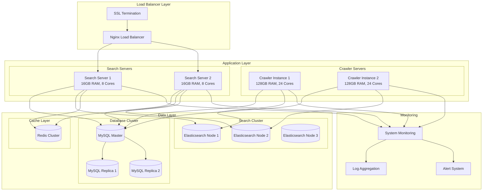
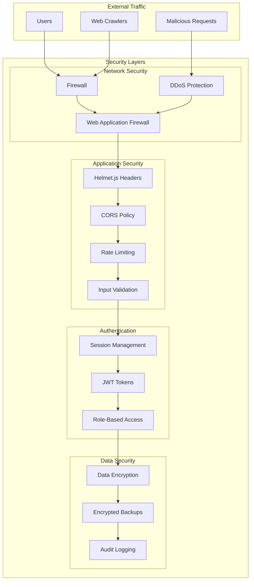
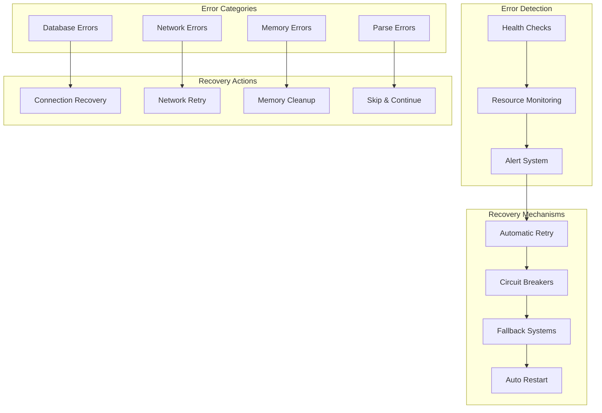

# SearchEngine Bhoomy - Architecture Diagram

## System Overview Architecture

## High-Level Component Architecture

## Data Flow Architecture

## Deployment Architecture

## Security Architecture

## Performance Architecture

```mermaid
graph LR
    subgraph "Performance Optimization"
        subgraph "Frontend Optimization"
            CDN[CDN Distribution]
            CACHE[Browser Caching]
            COMP[Gzip Compression]
            LAZY[Lazy Loading]
        end
        
        subgraph "Backend Optimization"
            POOL[Connection Pooling]
            REDIS[Redis Caching]
            BULK[Bulk Operations]
            INDEX[Database Indexes]
        end
        
        subgraph "Crawler Optimization"
            CONC[Concurrent Processing]
            LIMIT[Rate Limiting]
            BATCH[Batch Processing]
            MEMORY[Memory Management]
        end
        
        subgraph "Search Optimization"
            ELASTIC[Elasticsearch Tuning]
            HIGHLIGHT[Result Highlighting]
            FACET[Faceted Search]
            SUGGEST[Auto-Complete]
        end
    end
    
    CDN --> CACHE
    CACHE --> COMP
    COMP --> LAZY
    
    POOL --> REDIS
    REDIS --> BULK
    BULK --> INDEX
    
    CONC --> LIMIT
    LIMIT --> BATCH
    BATCH --> MEMORY
    
    ELASTIC --> HIGHLIGHT
    HIGHLIGHT --> FACET
    FACET --> SUGGEST
```

## Error Handling & Recovery Architecture

## Technology Stack Architecture

```mermaid
graph TB
    subgraph "Frontend Stack"
        REACT[React 18+ TypeScript]
        VITE[Vite Build Tool]
        TAILWIND[Tailwind CSS]
        FRAMER[Framer Motion]
        ZUSTAND[Zustand State]
    end
    
    subgraph "Backend Stack"
        NODE[Node.js 18+]
        EXPRESS[Express.js]
        HELMET_SEC[Helmet Security]
        WINSTON[Winston Logging]
        JOI[Joi Validation]
    end
    
    subgraph "Crawler Stack"
        CHEERIO[Cheerio HTML Parser]
        JSDOM[JSDOM]
        SHARP[Sharp Image Processing]
        PDF[PDF Parse]
        MAMMOTH[Mammoth DOC Parser]
    end
    
    subgraph "Database Stack"
        MYSQL_DB[MySQL 8.0+]
        MYSQL2[MySQL2 Driver]
        ELASTIC_DB[Elasticsearch 8.x]
        REDIS_DB[Redis Cache]
    end
    
    REACT --> VITE
    VITE --> TAILWIND
    TAILWIND --> FRAMER
    FRAMER --> ZUSTAND
    
    NODE --> EXPRESS
    EXPRESS --> HELMET_SEC
    HELMET_SEC --> WINSTON
    WINSTON --> JOI
    
    CHEERIO --> JSDOM
    JSDOM --> SHARP
    SHARP --> PDF
    PDF --> MAMMOTH
    
    MYSQL_DB --> MYSQL2
    MYSQL2 --> ELASTIC_DB
    ELASTIC_DB --> REDIS_DB
```

This architecture ensures scalability, reliability, and performance for the SearchEngine Bhoomy system with proper separation of concerns and robust error handling mechanisms. 