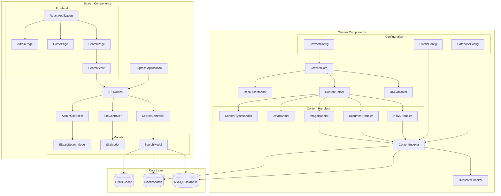
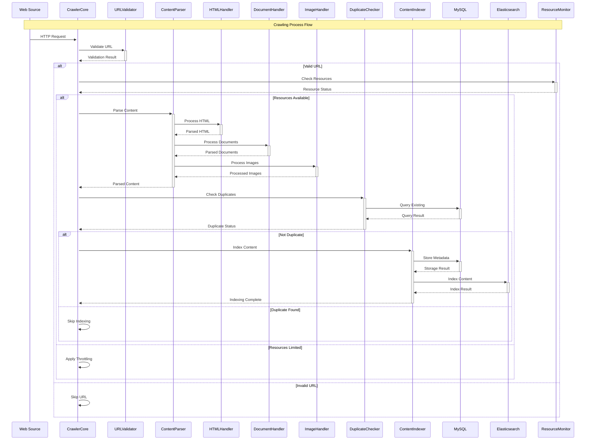
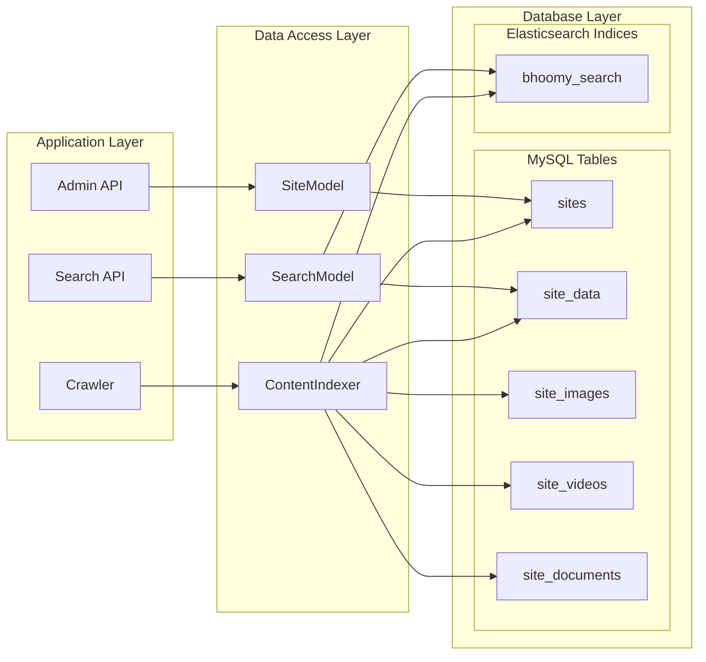
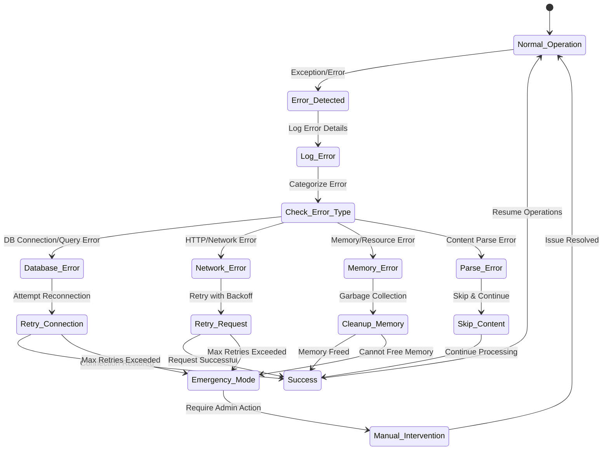
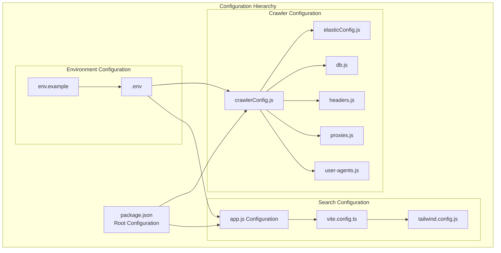
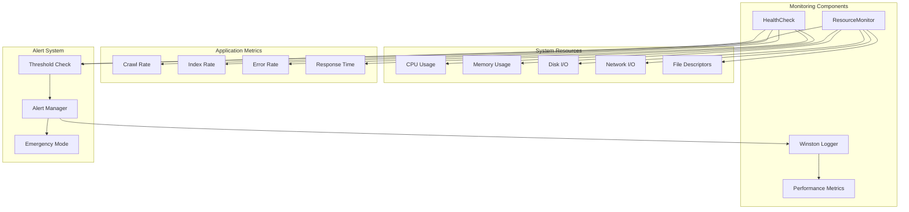
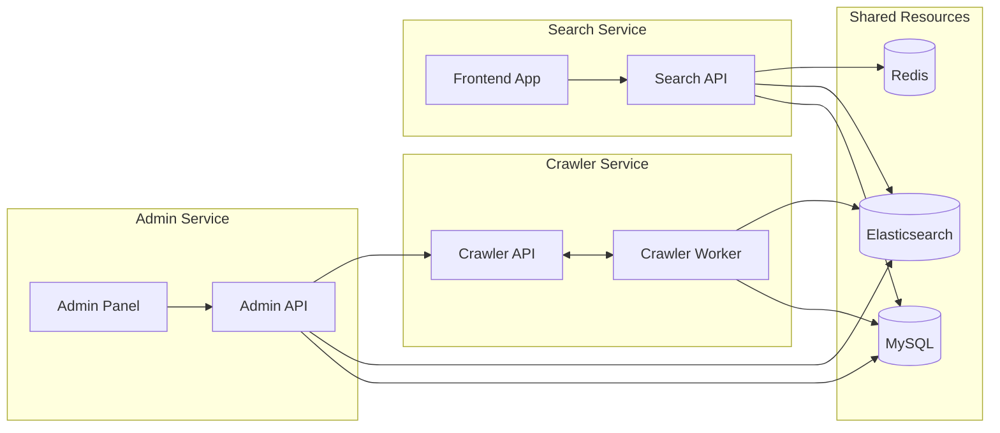

# SearchEngine Bhoomy - Component Interaction Diagram

## Core Component Interactions



## Detailed Component Flow Diagram



## Frontend Component Interactions

```mermaid
graph TB
    subgraph "React Frontend Architecture"
        APP[App.tsx]
        ROUTER[React Router]
        
        subgraph "Pages"
            HOME[HomePage]
            SEARCH[SearchPage]
            IMAGES[ImagesPage]
            VIDEOS[VideosPage]
            NEWS[NewsPage]
            ADMIN[AdminPage]
        end
        
        subgraph "Components"
            HEADER[Header]
            FOOTER[Footer]
            SEARCH_SUGGESTIONS[SearchSuggestions]
        end
        
        subgraph "State Management"
            SEARCH_STORE[SearchStore]
        end
        
        subgraph "Utils"
            API_CLIENT[ApiClient]
            MOCK_API[MockApi]
        end
        
        subgraph "Backend API"
            API_ROUTES_BE[API Routes]
            SEARCH_ENDPOINT[/api/search]
            HEALTH_ENDPOINT[/api/health]
        end
    end
    
    APP --> ROUTER
    ROUTER --> HOME
    ROUTER --> SEARCH
    ROUTER --> IMAGES
    ROUTER --> VIDEOS
    ROUTER --> NEWS
    ROUTER --> ADMIN
    
    HOME --> HEADER
    SEARCH --> HEADER
    SEARCH --> SEARCH_SUGGESTIONS
    
    SEARCH --> SEARCH_STORE
    SEARCH_STORE --> API_CLIENT
    API_CLIENT --> SEARCH_ENDPOINT
    API_CLIENT --> HEALTH_ENDPOINT
    
    SEARCH_ENDPOINT --> API_ROUTES_BE
    HEALTH_ENDPOINT --> API_ROUTES_BE
    
    HEADER --> FOOTER
```

## Database Interaction Patterns



## Error Handling Component Flow



## Configuration Component Dependencies



## Performance Monitoring Component Flow



## Inter-Service Communication



This component interaction diagram provides a comprehensive view of how all components in the SearchEngine Bhoomy system interact with each other, from the high-level architecture down to individual component communications and data flows. 