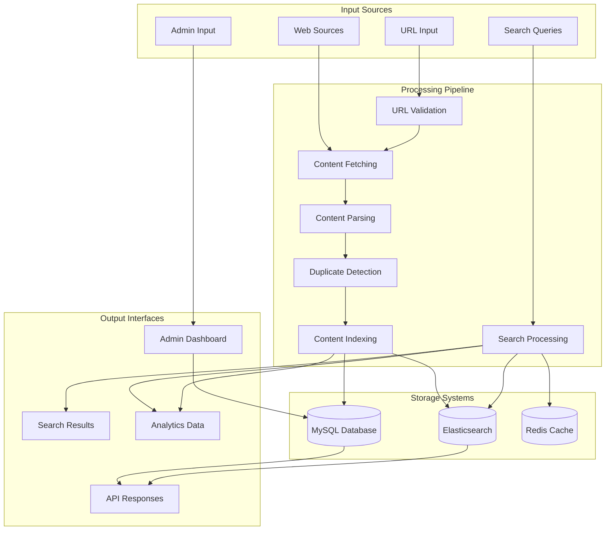
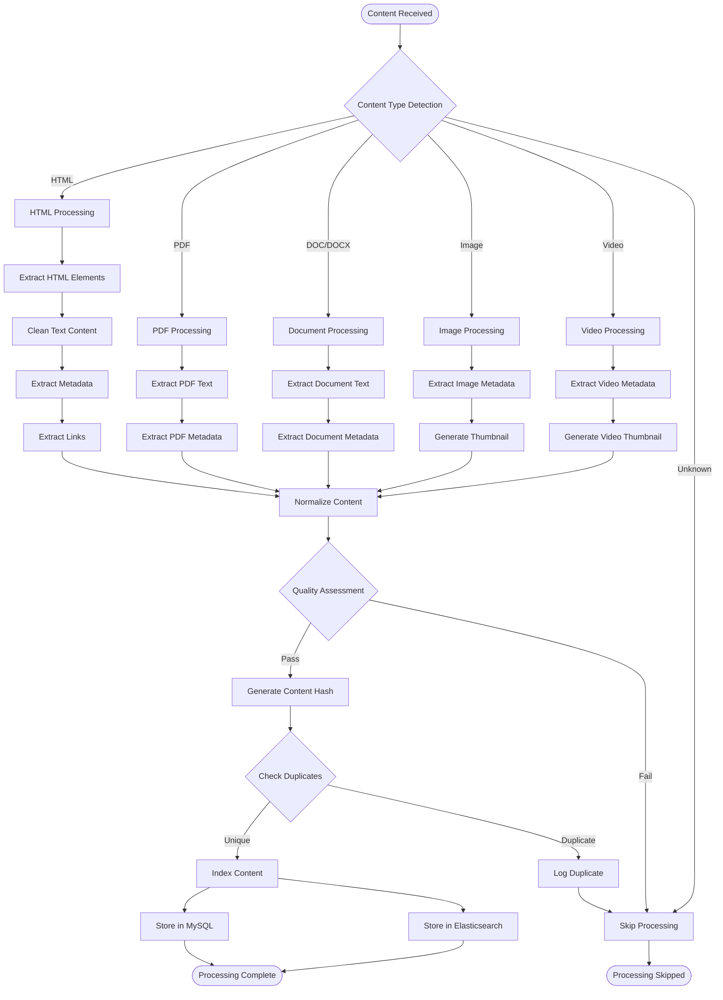
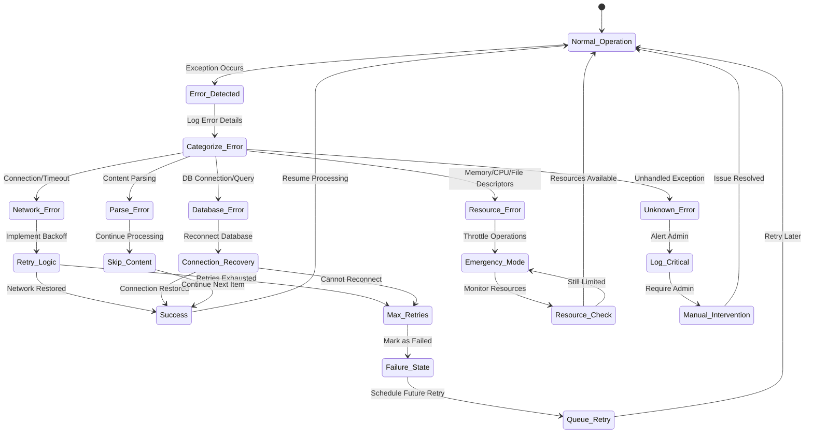
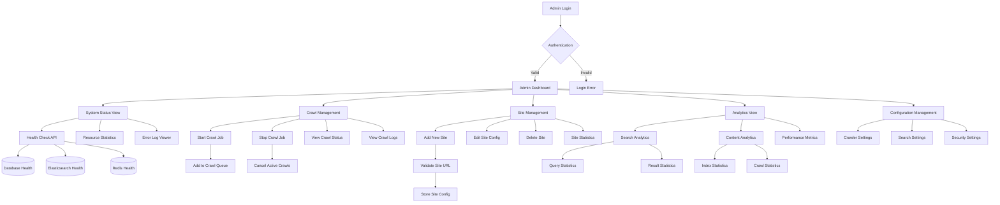

# SearchEngine Bhoomy - Functional Flow Diagram

## System Data Flow Overview



## Detailed Crawling Process Flow

```mermaid
sequenceDiagram
    participant A as Admin/System
    participant UV as URL Validator
    participant CF as Content Fetcher
    participant RM as Resource Monitor
    participant CP as Content Parser
    participant CH as Content Handlers
    participant DC as Duplicate Checker
    participant CI as Content Indexer
    participant DB as MySQL Database
    participant ES as Elasticsearch
    participant L as Logger
    
    Note over A,L: Web Crawling Process
    
    A->>+UV: Submit URL for crawling
    UV->>UV: Validate URL format
    UV->>UV: Check robots.txt
    UV->>UV: Normalize URL
    
    alt URL Valid
        UV->>+CF: Proceed with crawling
        CF->>+RM: Check system resources
        RM-->>-CF: Resource status
        
        alt Resources Available
            CF->>CF: Fetch HTTP content
            CF->>+CP: Parse content
            
            CP->>+CH: Route to appropriate handler
            
            alt HTML Content
                CH->>CH: Extract text, links, metadata
            else Document Content
                CH->>CH: Extract text from PDF/DOC
            else Image Content
                CH->>CH: Extract metadata, generate thumbnails
            else Video Content
                CH->>CH: Extract metadata, thumbnails
            end
            
            CH-->>-CP: Processed content
            CP-->>-CF: Parsed content data
            
            CF->>+DC: Check for duplicates
            DC->>+DB: Query existing content hash
            DB-->>-DC: Duplicate status
            
            alt Content is Unique
                DC->>+CI: Index new content
                
                par Database Storage
                    CI->>+DB: Store content metadata
                    DB-->>-CI: Storage confirmation
                and Elasticsearch Indexing
                    CI->>+ES: Index searchable content
                    ES-->>-CI: Index confirmation
                end
                
                CI-->>-DC: Indexing complete
                DC-->>-CF: Success response
            else Duplicate Found
                DC->>L: Log duplicate detection
                DC-->>-CF: Duplicate skip response
            end
            
            CF-->>-UV: Crawl complete
        else Resources Limited
            CF->>RM: Apply resource throttling
            CF->>L: Log resource constraint
            CF-->>-UV: Deferred crawl
        end
        
        UV-->>-A: Crawl result
    else URL Invalid
        UV->>L: Log invalid URL
        UV-->>-A: Validation error
    end
```

## Search Process Flow

```mermaid
sequenceDiagram
    participant U as User
    participant F as Frontend
    participant API as Search API
    participant V as Input Validator
    participant QP as Query Processor
    participant ES as Elasticsearch
    participant RC as Redis Cache
    participant DB as MySQL Database
    participant AR as Analytics Recorder
    
    Note over U,AR: Search Process Flow
    
    U->>+F: Enter search query
    F->>F: Validate input locally
    F->>+API: Submit search request
    
    API->>+V: Validate search parameters
    V-->>-API: Validation result
    
    alt Valid Query
        API->>+RC: Check cache for results
        
        alt Cache Hit
            RC-->>-API: Cached results
            API->>+AR: Record cache hit
            AR-->>-API: Analytics logged
        else Cache Miss
            RC-->>-API: No cached results
            
            API->>+QP: Process search query
            QP->>QP: Build Elasticsearch query
            QP->>QP: Apply filters and sorting
            
            QP->>+ES: Execute search query
            ES-->>-QP: Search results
            
            QP->>+DB: Fetch additional metadata
            DB-->>-QP: Content metadata
            
            QP->>QP: Format and rank results
            QP-->>-API: Processed results
            
            API->>+RC: Cache search results
            RC-->>-API: Cache stored
            
            API->>+AR: Record search metrics
            AR-->>-API: Analytics logged
        end
        
        API-->>-F: Search results
        F->>F: Render results
        F-->>-U: Display search results
    else Invalid Query
        API->>+AR: Record invalid query
        AR-->>-API: Analytics logged
        API-->>-F: Validation error
        F-->>-U: Error message
    end
```

## Content Processing Flow



## Error Handling Flow



## Admin Dashboard Flow



## API Request Flow

```mermaid
sequenceDiagram
    participant C as Client
    participant MW as Middleware Stack
    participant RL as Rate Limiter
    participant V as Validator
    participant AUTH as Authenticator
    participant CTRL as Controller
    participant M as Model
    participant DB as Database
    participant CACHE as Cache
    
    Note over C,CACHE: API Request Processing
    
    C->>+MW: HTTP Request
    MW->>+RL: Check rate limits
    
    alt Within Rate Limits
        RL->>+V: Validate request
        V->>V: Schema validation
        V->>V: Input sanitization
        
        alt Valid Request
            V->>+AUTH: Authenticate request
            
            alt Authenticated/Public
                AUTH->>+CTRL: Route to controller
                CTRL->>+M: Call model method
                
                M->>+CACHE: Check cache
                alt Cache Hit
                    CACHE-->>-M: Cached data
                else Cache Miss
                    CACHE-->>-M: No cache
                    M->>+DB: Query database
                    DB-->>-M: Database result
                    M->>CACHE: Update cache
                end
                
                M-->>-CTRL: Data result
                CTRL->>CTRL: Format response
                CTRL-->>-AUTH: Response data
                
                AUTH-->>-V: Success response
            else Authentication Failed
                AUTH-->>-V: Auth error
            end
            
            V-->>-RL: Response
        else Invalid Request
            V-->>-RL: Validation error
        end
        
        RL-->>-MW: Final response
    else Rate Limit Exceeded
        RL-->>-MW: Rate limit error
    end
    
    MW->>MW: Add security headers
    MW->>MW: Log request
    MW-->>-C: HTTP Response
```

This functional flow documentation provides a comprehensive view of how data moves through the SearchEngine Bhoomy system, from initial input through processing, storage, and final output, including error handling and administrative functions. 