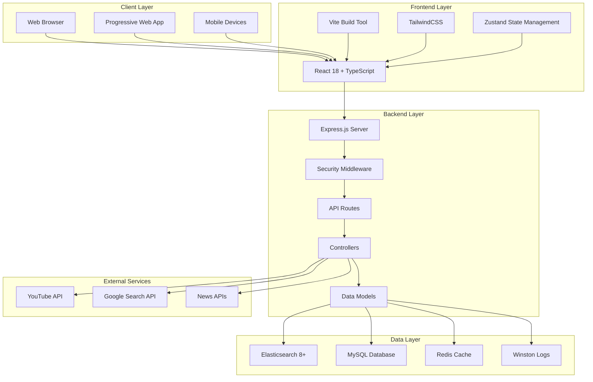
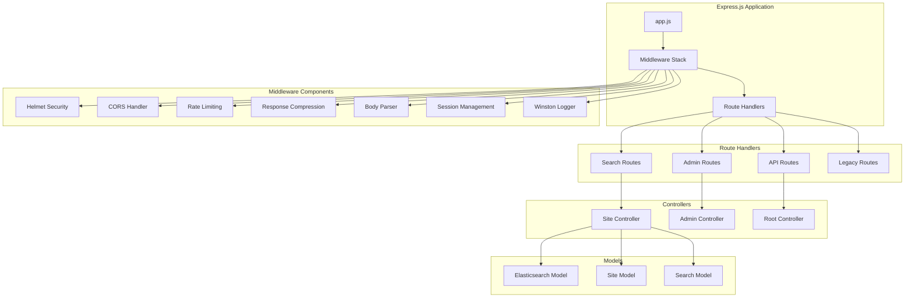
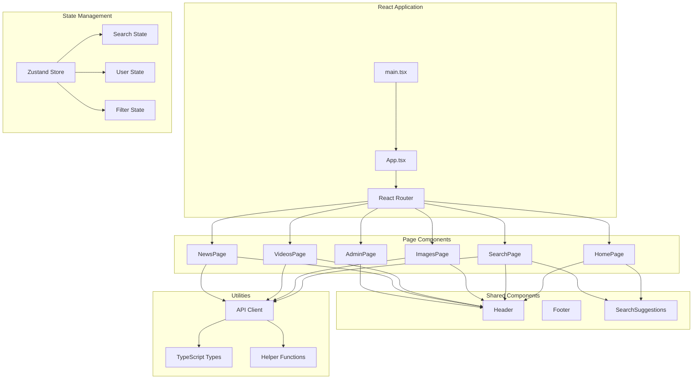
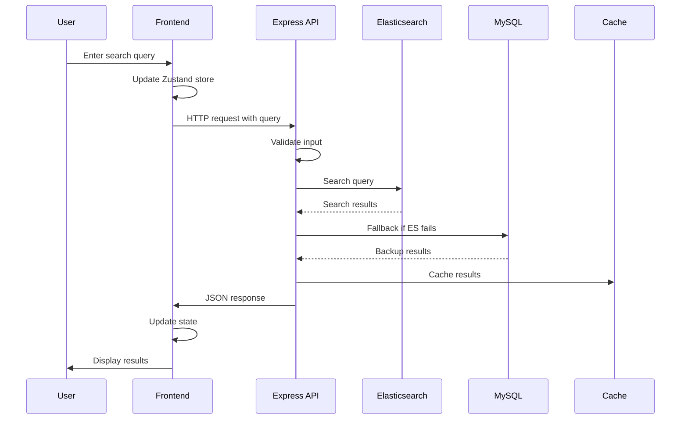
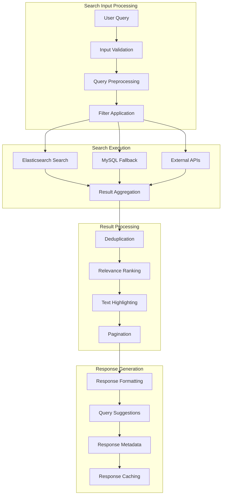
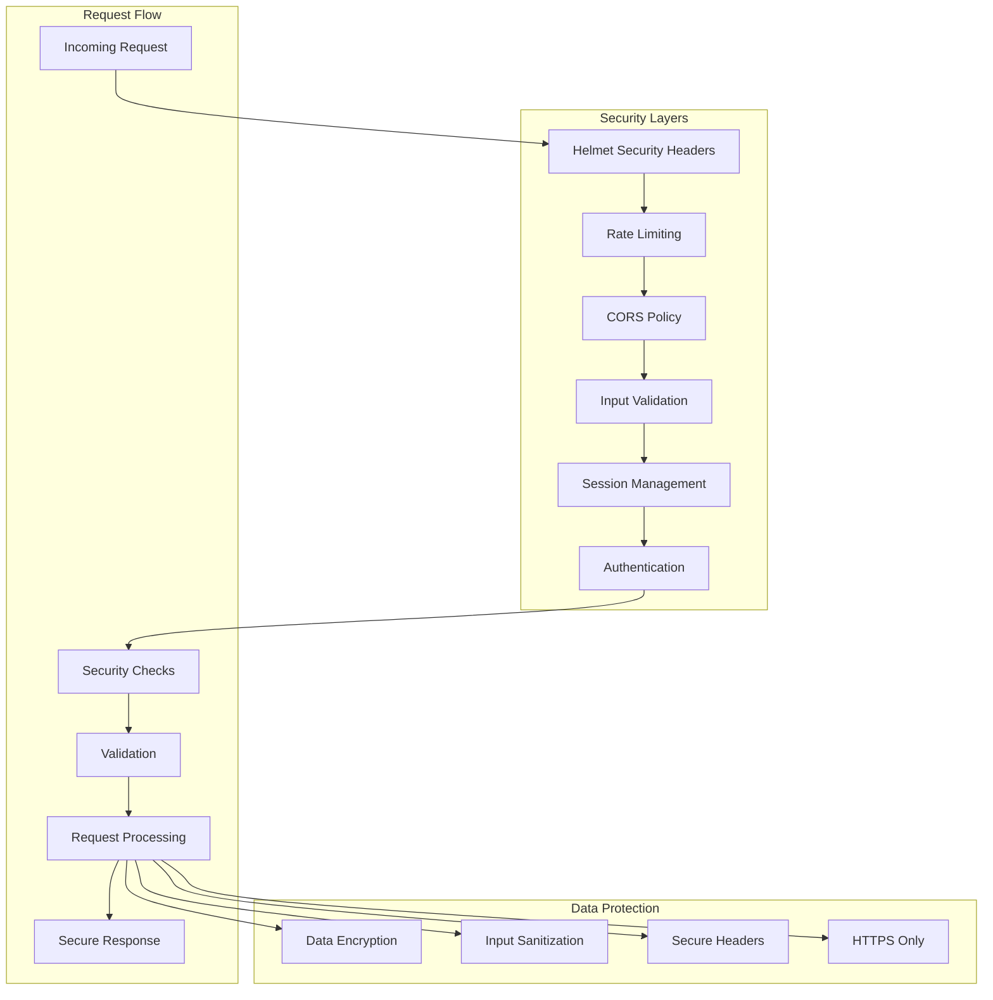
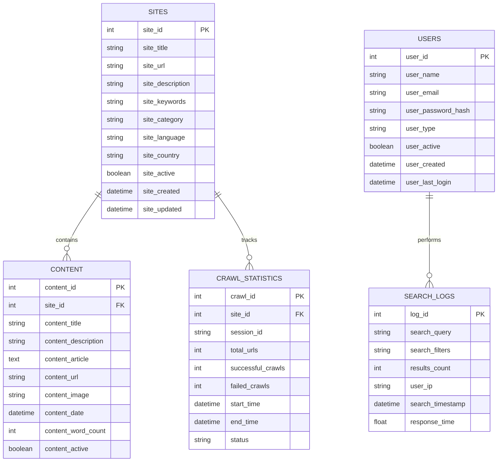
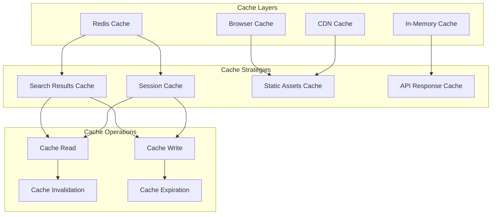
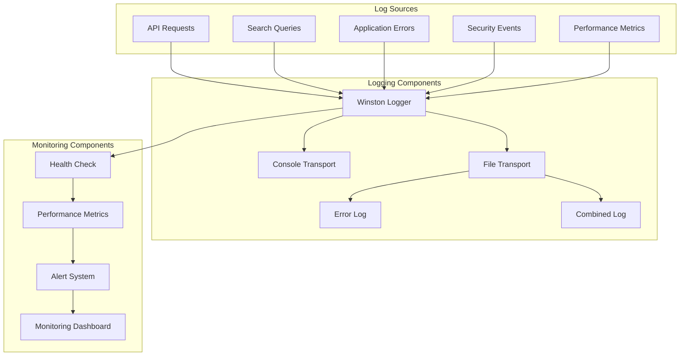
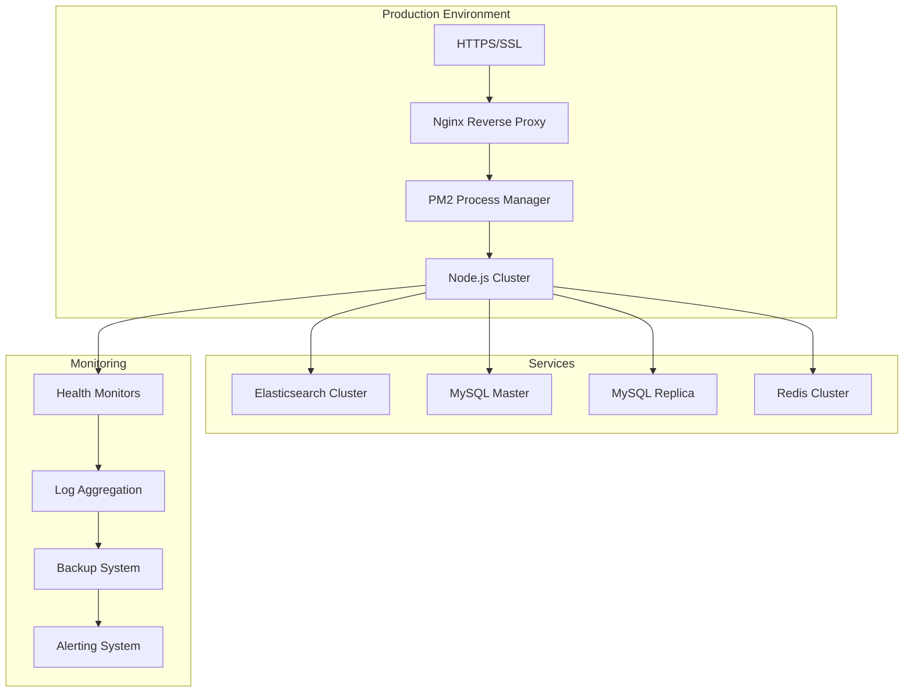

# Bhoomy Search Engine - Architecture Diagram

## Overview
This document provides detailed architectural diagrams for the Bhoomy Search Engine, illustrating the system's components, data flow, and interactions between different layers.

## 1. High-Level System Architecture

## 2. Backend Architecture Details

## 3. Frontend Architecture Details

## 4. Data Flow Architecture

## 5. Search Engine Architecture

## 6. Security Architecture

## 7. Database Architecture

## 8. Caching Architecture

## 9. Monitoring and Logging Architecture

## 10. Deployment Architecture

## Technology Stack Summary

### Frontend Technologies
- **React 18** - Modern React with concurrent features
- **TypeScript** - Type safety and better developer experience
- **Vite** - Fast build tool and development server
- **TailwindCSS** - Utility-first CSS framework
- **Zustand** - Lightweight state management
- **Framer Motion** - Animation library

### Backend Technologies
- **Node.js 18+** - JavaScript runtime
- **Express.js** - Web framework
- **Winston** - Logging library
- **Joi** - Input validation
- **Helmet** - Security headers
- **PM2** - Process manager

### Database Technologies
- **Elasticsearch 8+** - Search engine
- **MySQL** - Relational database
- **Redis** - In-memory cache
- **Connection Pooling** - Database optimization

### DevOps & Security
- **Docker** - Containerization
- **Nginx** - Reverse proxy
- **SSL/TLS** - Encryption
- **Rate Limiting** - API protection
- **Health Checks** - System monitoring

This architecture provides a scalable, secure, and maintainable foundation for the Bhoomy search engine, supporting high availability and performance requirements. 