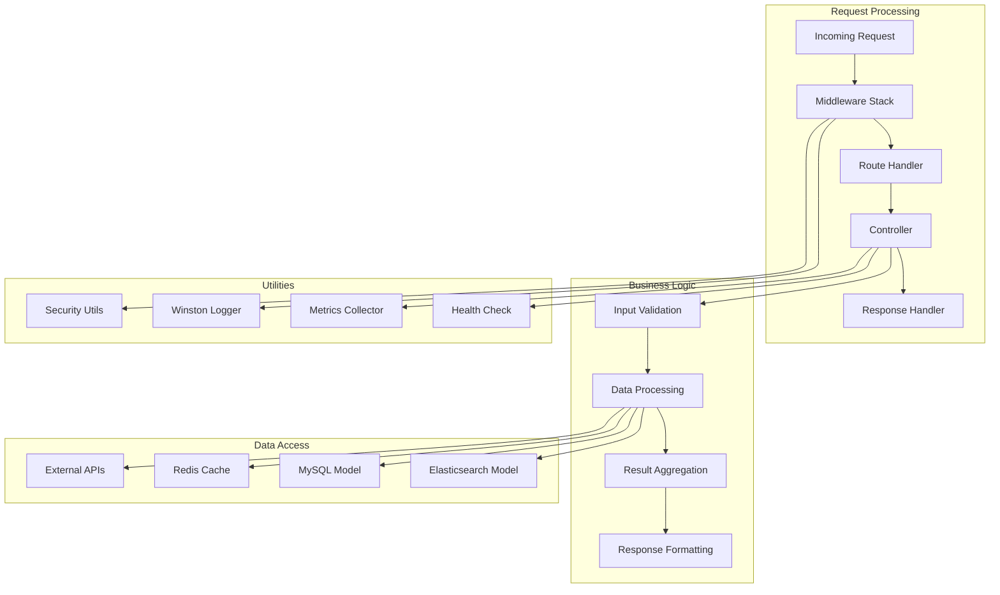
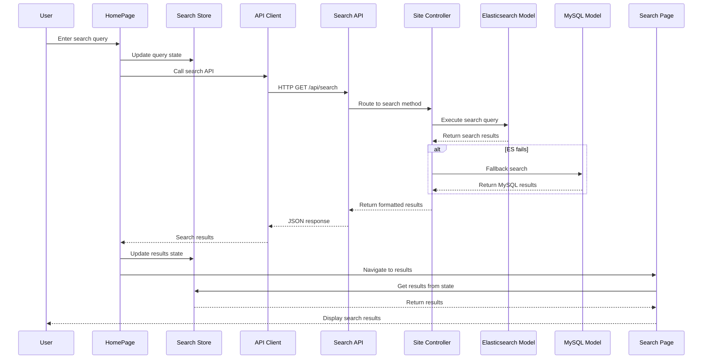
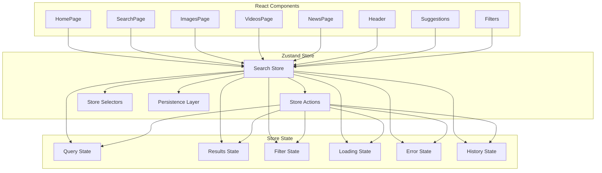
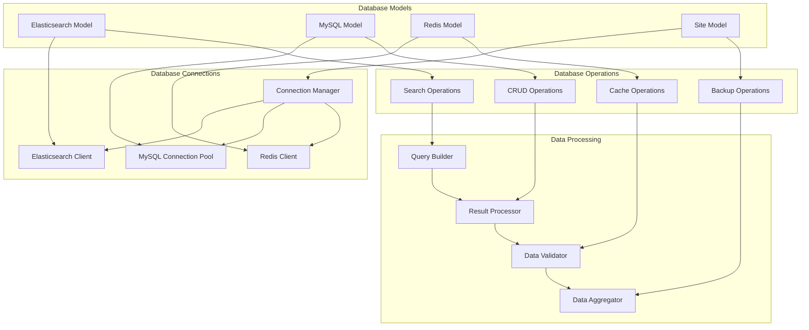
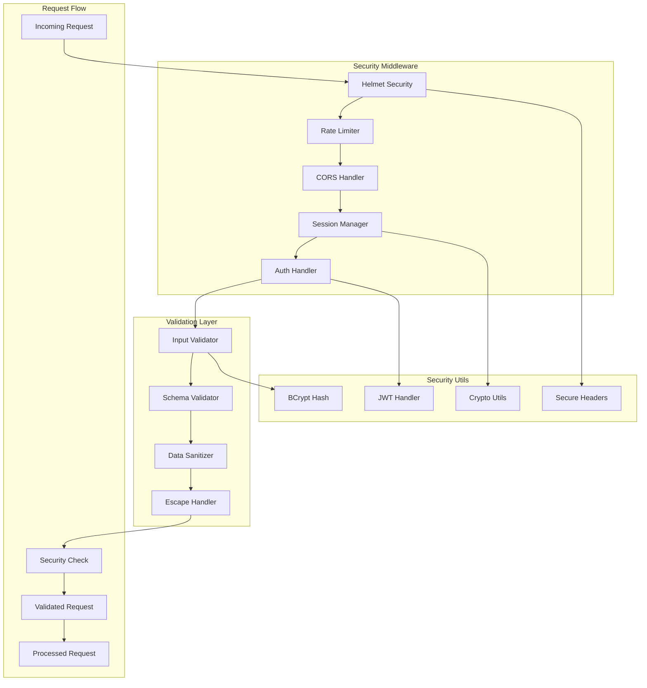
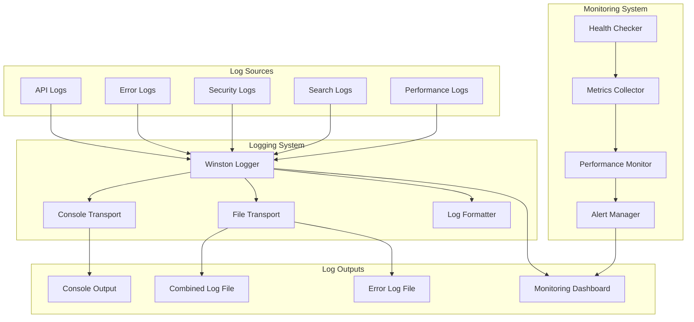
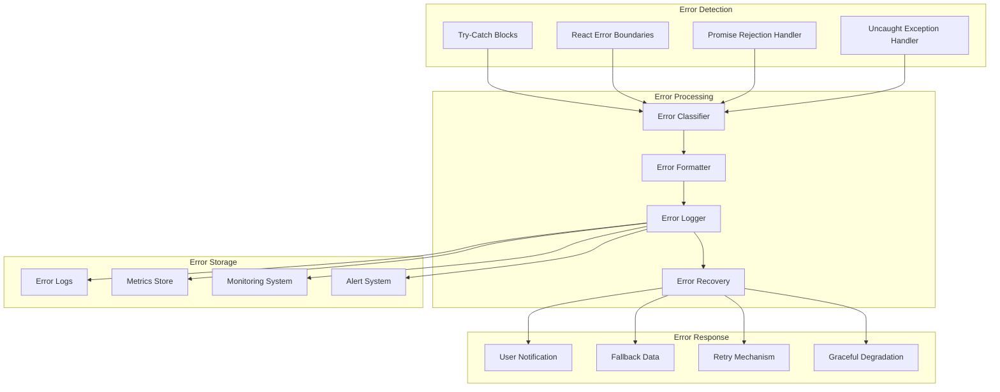
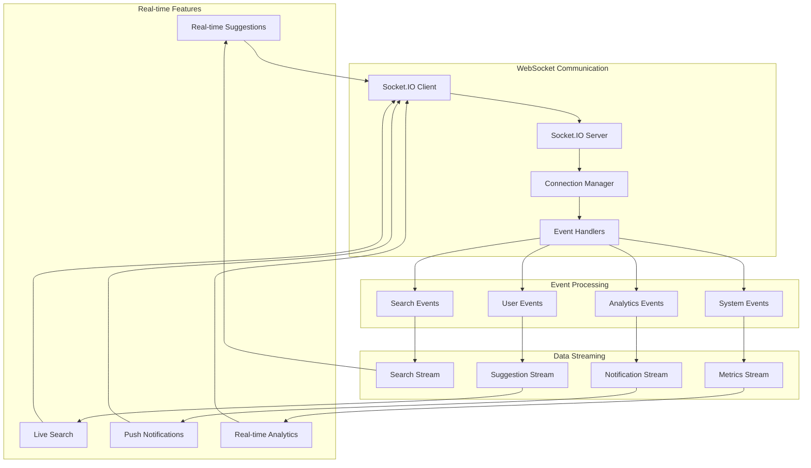

# Bhoomy Search Engine - Component Interaction Diagram

## Overview
This document provides detailed component interaction diagrams for the Bhoomy Search Engine, illustrating how different components communicate with each other, data flow patterns, and integration points.

## 1. Frontend Component Interaction Flow

```mermaid
graph TB
    subgraph "User Interface Components"
        HOME[HomePage Component]
        SEARCH[SearchPage Component]
        IMAGES[ImagesPage Component]
        VIDEOS[VideosPage Component]
        NEWS[NewsPage Component]
        ADMIN[AdminPage Component]
    end
    
    subgraph "Shared Components"
        HEADER[Header Component]
        FOOTER[Footer Component]
        SUGGESTIONS[SearchSuggestions Component]
        PAGINATION[Pagination Component]
        FILTERS[FilterPanel Component]
    end
    
    subgraph "State Management"
        STORE[Zustand Store]
        SEARCH_STATE[Search State]
        USER_STATE[User State]
        FILTER_STATE[Filter State]
    end
    
    subgraph "API Layer"
        API_CLIENT[API Client]
        SEARCH_API[Search API]
        IMAGES_API[Images API]
        VIDEOS_API[Videos API]
        NEWS_API[News API]
    end
    
    HOME --> HEADER
    SEARCH --> HEADER
    IMAGES --> HEADER
    VIDEOS --> HEADER
    NEWS --> HEADER
    ADMIN --> HEADER
    
    HOME --> SUGGESTIONS
    SEARCH --> SUGGESTIONS
    
    SEARCH --> PAGINATION
    IMAGES --> PAGINATION
    VIDEOS --> PAGINATION
    NEWS --> PAGINATION
    
    SEARCH --> FILTERS
    IMAGES --> FILTERS
    VIDEOS --> FILTERS
    NEWS --> FILTERS
    
    STORE --> SEARCH_STATE
    STORE --> USER_STATE
    STORE --> FILTER_STATE
    
    SEARCH --> STORE
    IMAGES --> STORE
    VIDEOS --> STORE
    NEWS --> STORE
    
    API_CLIENT --> SEARCH_API
    API_CLIENT --> IMAGES_API
    API_CLIENT --> VIDEOS_API
    API_CLIENT --> NEWS_API
    
    SEARCH --> API_CLIENT
    IMAGES --> API_CLIENT
    VIDEOS --> API_CLIENT
    NEWS --> API_CLIENT
```



## 2. Backend Component Interaction Flow



## 3. Search Flow Component Interaction



## 4. State Management Component Interaction



## 5. API Client Component Interaction

```mermaid
graph TB
    subgraph "API Client Core"
        CLIENT[APIClient Class]
        AXIOS[Axios Instance]
        INTERCEPTORS[Request/Response Interceptors]
        ERROR_HANDLER[Error Handler]
    end
    
    subgraph "API Methods"
        SEARCH_METHOD[search()]
        IMAGES_METHOD[searchImages()]
        VIDEOS_METHOD[searchVideos()]
        NEWS_METHOD[searchNews()]
        SUGGESTIONS_METHOD[getSuggestions()]
        HEALTH_METHOD[healthCheck()]
    end
    
    subgraph "Response Handling"
        RESPONSE_HANDLER[Response Handler]
        ERROR_PROCESSOR[Error Processor]
        FALLBACK_HANDLER[Fallback Handler]
        CACHE_MANAGER[Cache Manager]
    end
    
    subgraph "Backend APIs"
        SEARCH_API[/api/search]
        IMAGES_API[/api/images]
        VIDEOS_API[/api/videos]
        NEWS_API[/api/news]
        SUGGESTIONS_API[/api/suggestions]
        HEALTH_API[/api/health]
    end
    
    CLIENT --> AXIOS
    AXIOS --> INTERCEPTORS
    INTERCEPTORS --> ERROR_HANDLER
    
    CLIENT --> SEARCH_METHOD
    CLIENT --> IMAGES_METHOD
    CLIENT --> VIDEOS_METHOD
    CLIENT --> NEWS_METHOD
    CLIENT --> SUGGESTIONS_METHOD
    CLIENT --> HEALTH_METHOD
    
    SEARCH_METHOD --> RESPONSE_HANDLER
    IMAGES_METHOD --> RESPONSE_HANDLER
    VIDEOS_METHOD --> RESPONSE_HANDLER
    NEWS_METHOD --> RESPONSE_HANDLER
    SUGGESTIONS_METHOD --> RESPONSE_HANDLER
    HEALTH_METHOD --> RESPONSE_HANDLER
    
    RESPONSE_HANDLER --> ERROR_PROCESSOR
    ERROR_PROCESSOR --> FALLBACK_HANDLER
    RESPONSE_HANDLER --> CACHE_MANAGER
    
    SEARCH_METHOD --> SEARCH_API
    IMAGES_METHOD --> IMAGES_API
    VIDEOS_METHOD --> VIDEOS_API
    NEWS_METHOD --> NEWS_API
    SUGGESTIONS_METHOD --> SUGGESTIONS_API
    HEALTH_METHOD --> HEALTH_API
```

## 6. Database Component Interaction



## 7. Security Component Interaction



## 8. Logging and Monitoring Component Interaction



## 9. Error Handling Component Interaction



## 10. Real-time Component Interaction



## Component Interaction Summary

### Key Interaction Patterns

1. **Request-Response Pattern**: Traditional HTTP API interactions
2. **Event-Driven Pattern**: Real-time features using WebSockets
3. **State Management Pattern**: Centralized state using Zustand
4. **Middleware Pattern**: Request processing pipeline
5. **Observer Pattern**: Component updates based on state changes
6. **Fallback Pattern**: Graceful degradation when services fail

### Communication Protocols

- **HTTP/HTTPS**: REST API communication
- **WebSocket**: Real-time bidirectional communication
- **JSON**: Data exchange format
- **EventEmitter**: Node.js internal event handling

### Error Handling Strategies

- **Circuit Breaker**: Prevent cascading failures
- **Retry Logic**: Automatic retry with exponential backoff
- **Fallback Mechanisms**: Alternative data sources
- **Graceful Degradation**: Reduced functionality instead of complete failure

### Performance Optimizations

- **Caching Layers**: Multiple levels of caching
- **Connection Pooling**: Efficient database connections
- **Lazy Loading**: Load components on demand
- **Debouncing**: Reduce API calls for search suggestions

This component interaction design ensures a robust, scalable, and maintainable architecture with clear separation of concerns and well-defined communication patterns. 