# Bhoomy Search Engine - Functional Flow Diagram

## Overview
This document provides detailed functional flow diagrams for the Bhoomy Search Engine, illustrating the complete user journey, system processes, and data flow for all major features.

## 1. Main Search Flow

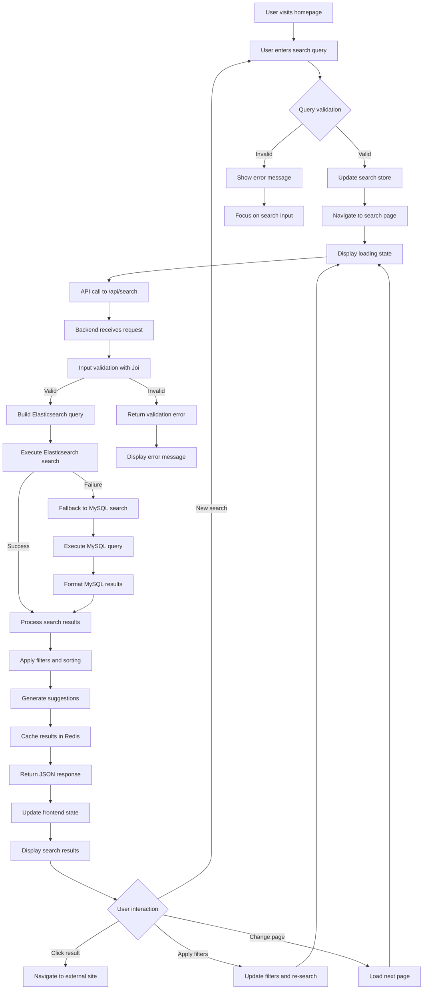

## 2. Image Search Flow

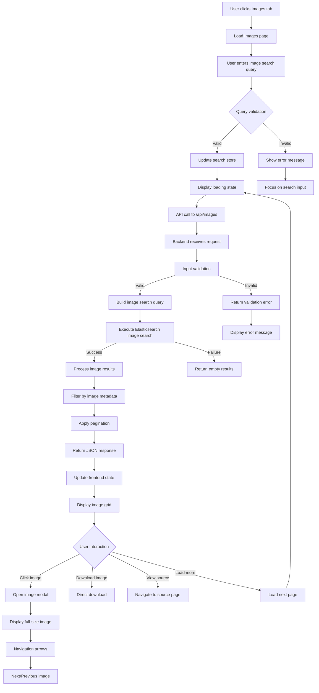

## 3. Video Search Flow

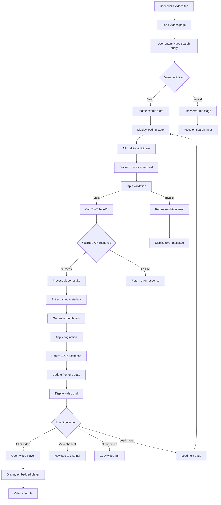

## 4. News Search Flow

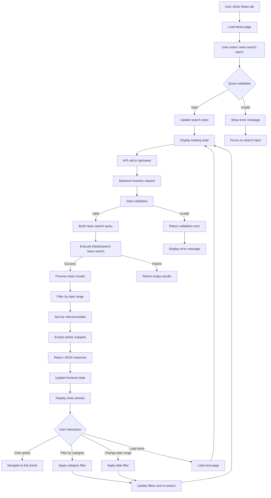

## 5. Search Suggestions Flow

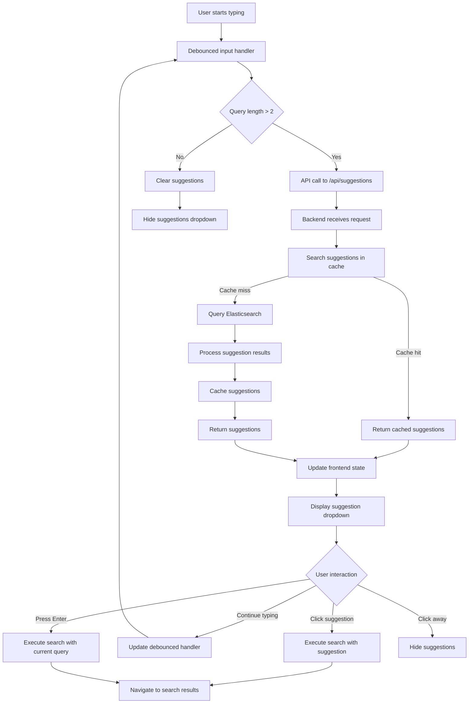

## 6. User Authentication Flow

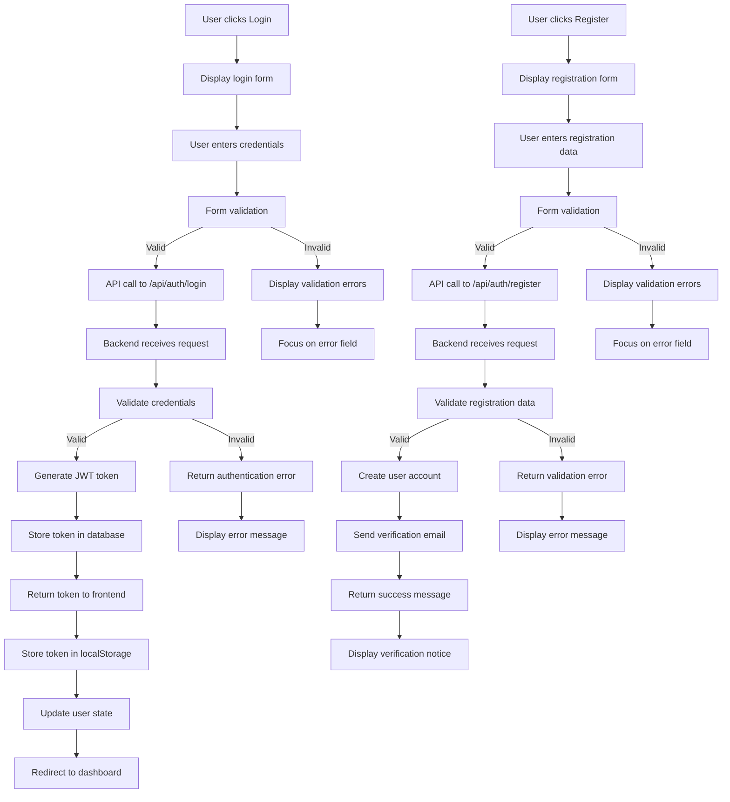

## 7. Admin Dashboard Flow

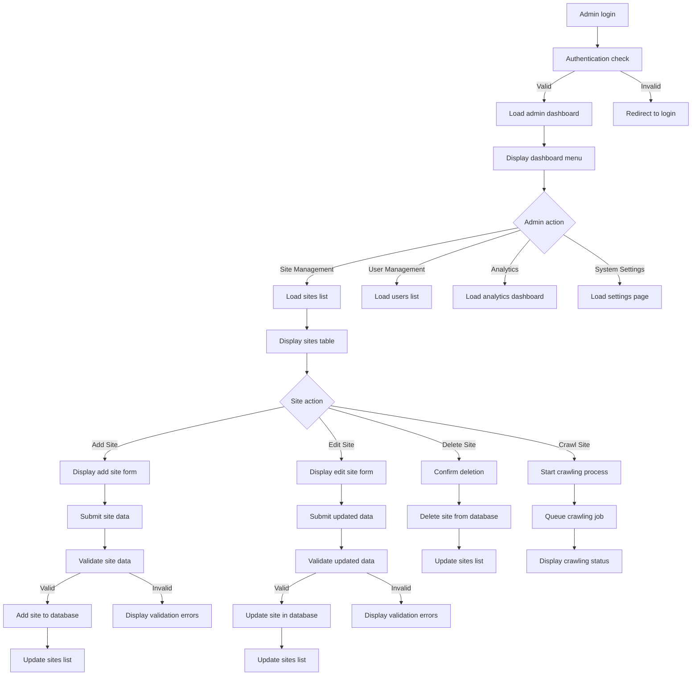

## 8. Content Crawling Flow

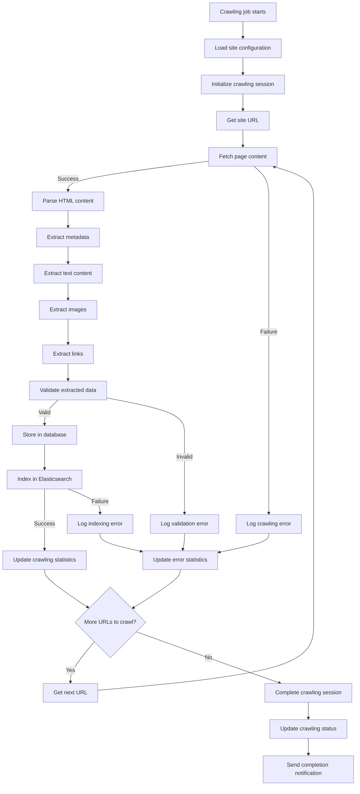

## 9. Search Result Processing Flow

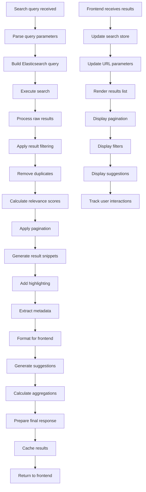

## 10. Error Handling Flow

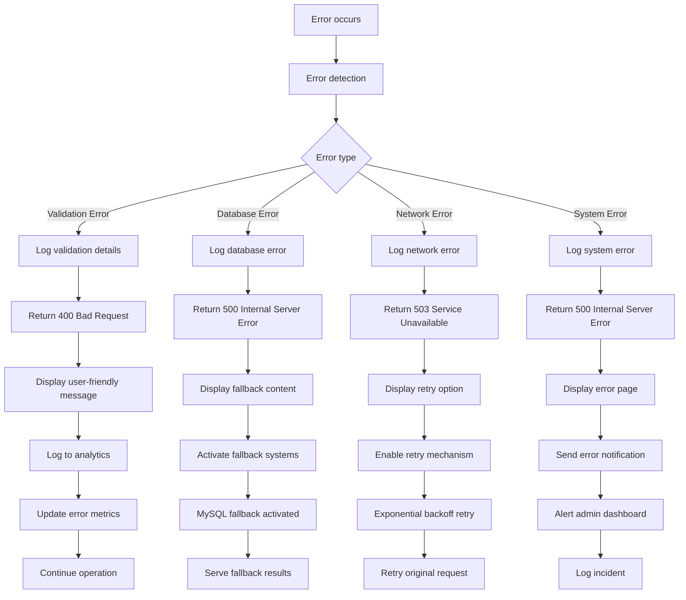

## 11. Performance Optimization Flow

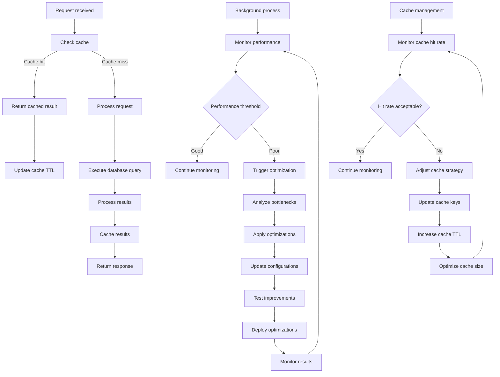

## 12. Security Validation Flow

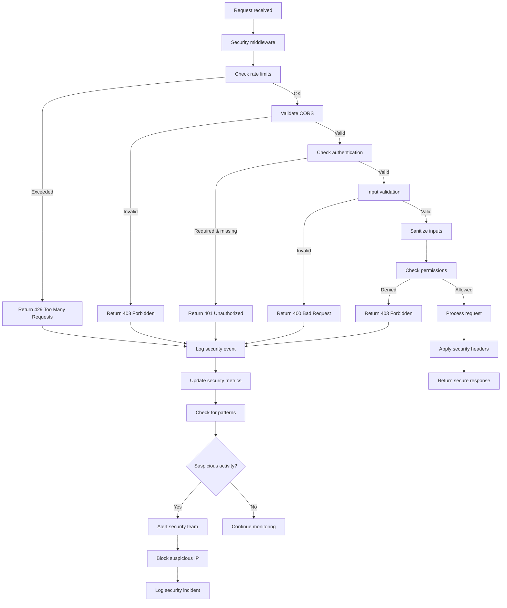

## Process Flow Summary

### Key Flow Patterns

1. **Request-Response Pattern**: All API interactions follow validation → processing → response
2. **Error-First Pattern**: Comprehensive error handling at each step
3. **Caching Pattern**: Check cache → process if needed → cache results
4. **Fallback Pattern**: Primary service → fallback service → error state
5. **Security Pattern**: Authentication → authorization → validation → processing

### Performance Considerations

- **Debouncing**: Search suggestions use debounced input to reduce API calls
- **Caching**: Multiple cache layers for optimal performance
- **Pagination**: Large result sets are paginated to improve load times
- **Lazy Loading**: Images and components loaded on demand
- **Connection Pooling**: Database connections optimized for concurrent requests

### Error Recovery Mechanisms

- **Circuit Breaker**: Prevents cascading failures
- **Retry Logic**: Exponential backoff for temporary failures
- **Fallback Systems**: MySQL fallback when Elasticsearch fails
- **Graceful Degradation**: Reduced functionality instead of complete failure

### Security Flow Integration

- **Input Validation**: All user inputs validated before processing
- **Rate Limiting**: Prevents abuse and ensures fair usage
- **Authentication**: Secure token-based authentication
- **Authorization**: Role-based access control
- **Audit Logging**: All security events logged for monitoring

This functional flow design ensures robust, secure, and performant operation of the Bhoomy Search Engine while providing excellent user experience and system reliability. 